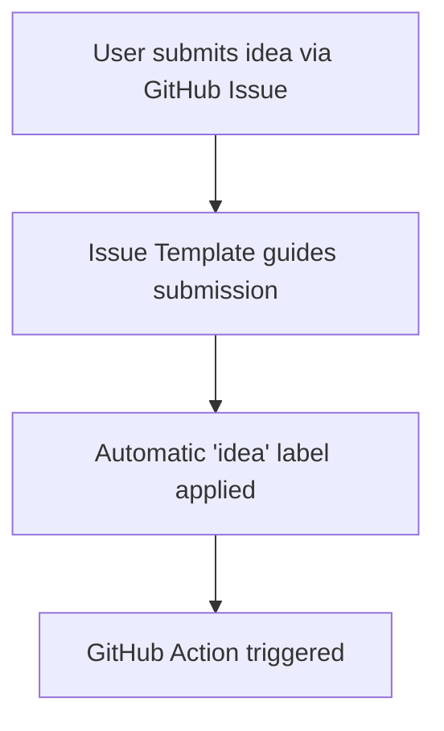
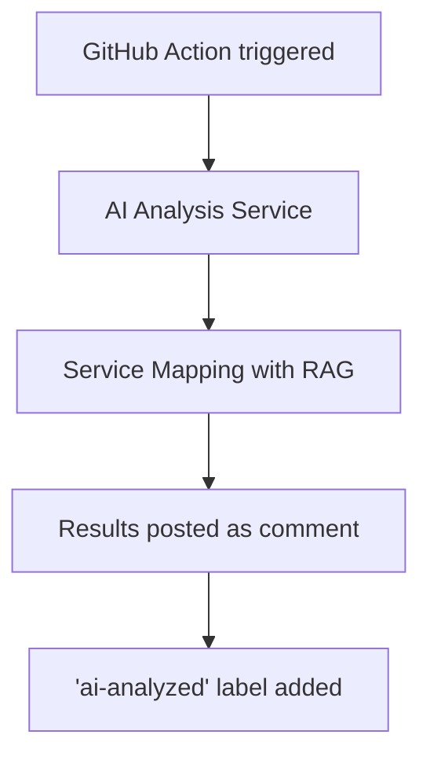
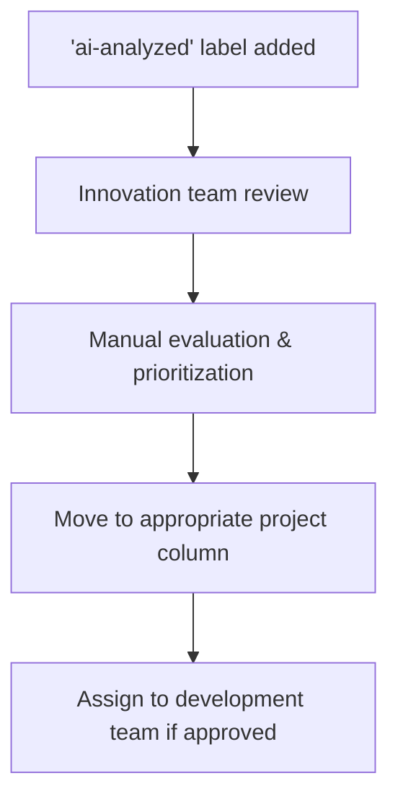

# Innovation Hub - GitHub-First Architecture

## Overview

The **GitHub-First Innovation Hub** is a modern approach to innovation management that leverages GitHub as the primary platform for idea submission, analysis, and tracking. This architecture eliminates the need for separate backend systems by using GitHub's native features.

## Key Components

### 1. Idea Submission via GitHub Issues

- **Issue Template**: Structured form at `.github/ISSUE_TEMPLATE/idea.yml`
- **Labels**: Automatic labeling (`idea`, `needs-triage`, `ai-analyzed`)
- **Metadata**: All idea information stored in GitHub issue body

### 2. AI-Powered Analysis

- **GitHub Action**: `.github/workflows/ai-analysis.yml`
- **AI Services**:
  - Primary: Göteborg vLLM (`https://esbst.goteborg.se/vllm-19020/v1`)
  - Secondary: Bifrost Gateway (`https://llm.innovationsarenan.se/v1`)
  - Fallback: OpenRouter
- **Analysis Components**:
  - Idea evaluation (impact, feasibility, innovation score)
  - Service mapping (RAG-based)
  - Implementation recommendations

### 3. Service Mapping with RAG

- **RAG Service**: `rag_service_integration.py`
- **Capabilities**:
  - Identifies related existing services
  - Provides integration recommendations
  - Confidence scoring for mappings

### 4. Workflow Visualization

- **GitHub Projects**: Kanban-style board for tracking progress
- **Columns**:
  - 💡 New Ideas
  - 🤖 AI Analysis
  - 👥 Under Review
  - 🚀 Approved
  - 🔧 In Development
  - ✅ Completed
  - ❌ Rejected

## Workflow Process

### 1. Idea Submission



### 2. Automated Analysis



### 3. Human Review & Processing



## Technical Implementation

### Environment Variables Required

```env
# GitHub Configuration
GITHUB_TOKEN=ghp_your_token_here

# AI Service Configuration  
AI_SERVICE_URL=https://llm.innovationsarenan.se/v1
AI_API_KEY=your_ai_api_key

# RAG Service Configuration
RAG_SERVICE_URL=https://esbst.goteborg.se/vllm-19020/v1
RAG_API_KEY=your_rag_api_key

# Fallback Configuration
OPENROUTER_API_KEY=your_openrouter_key
```

### Service Mapping Configuration

The RAG service uses Göteborg City's service catalog to identify:

1. **Directly related services** - Existing services that address similar needs
2. **Overlapping services** - Services with partial functionality overlap
3. **Complementary services** - Services that could integrate with the new idea
4. **Affected services** - Services that might need updates

### AI Analysis Output Format

```json
{
  "summary": "Brief summary of the idea",
  "potential_impact": "High/Medium/Low",
  "feasibility": "High/Medium/Low",
  "innovation_score": 8,
  "recommendation": "Detailed recommendation",
  "implementation_challenges": ["Challenge 1", "Challenge 2"],
  "success_factors": ["Factor 1", "Factor 2"],
  "related_services": ["Service A", "Service B"]
}
```

## Benefits of GitHub-First Approach

### 1. **Single Source of Truth**
- All innovation data stored in GitHub
- No separate database management required
- Full audit trail and version history

### 2. **Seamless Integration**
- Native GitHub UI for all operations
- Built-in notifications and mentions
- Easy linking to development work (PRs, issues)

### 3. **Automation Ready**
- GitHub Actions for automated processing
- Webhook support for external integrations
- API access for custom tooling

### 4. **Collaboration Features**
- Comments and discussions on ideas
- @mentions for team members
- Reaction emojis for quick feedback

### 5. **Traceability**
- Clear path from idea → analysis → implementation
- Linkable references between issues and PRs
- Comprehensive activity logs

## Setup Instructions

### 1. Repository Setup

```bash
# Clone the repository
git clone https://github.com/Frallans76Organisation/innovation-hub.git
cd innovation-hub

# Create the feature branch
git checkout -b github-first-innovation-hub
```

### 2. Configure GitHub Secrets

1. Go to Repository Settings → Secrets → Actions
2. Add the required environment variables:
   - `AI_API_KEY`
   - `RAG_API_KEY`
   - `OPENROUTER_API_KEY` (optional)

### 3. Enable GitHub Projects

1. Go to Repository → Projects
2. Create new project with Kanban template
3. Set up columns as specified above
4. Configure automation to move issues based on labels

### 4. Test the Workflow

```bash
# Create a test issue
gh issue create \
  --title "Test Innovation Idea" \
  --body "This is a test idea for testing the workflow" \
  --label "idea"
```

## Monitoring and Maintenance

### Monitoring

- **GitHub Actions Logs**: Monitor workflow execution
- **Issue Comments**: Review AI analysis results
- **Project Board**: Track idea progress visually

### Maintenance Tasks

1. **Regular Service Catalog Updates**: Keep RAG service current
2. **AI Model Monitoring**: Track analysis quality
3. **Workflow Optimization**: Review and improve automation
4. **User Feedback**: Incorporate user suggestions

## Troubleshooting

### Common Issues

1. **AI Service Failures**:
   - Check API keys and endpoints
   - Verify network connectivity
   - Review error logs in GitHub Actions

2. **RAG Service Issues**:
   - Ensure service catalog is up-to-date
   - Check embedding quality
   - Verify API authentication

3. **GitHub Action Problems**:
   - Check YAML syntax
   - Verify environment variables
   - Review action permissions

### Debugging Tips

```bash
# Test AI service connectivity
curl -X POST https://llm.innovationsarenan.se/v1/chat/completions \
  -H "Content-Type: application/json" \
  -H "Authorization: Bearer your_api_key" \
  -d '{"model": "mistralai/Devstral-2-123B-Instruct-2512", "messages": [{"role": "user", "content": "Test"}]}'

# Test RAG service
python rag_service_integration.py "Test Idea" "Test description"
```

## Future Enhancements

### Planned Features

1. **Advanced Analytics Dashboard**
   - Idea submission trends
   - Analysis quality metrics
   - Service mapping effectiveness

2. **Integration with City Systems**
   - Service catalog synchronization
   - Employee directory integration
   - Budget tracking

3. **Enhanced Automation**
   - Automatic prioritization
   - Team assignment suggestions
   - Progress tracking

4. **User Engagement Features**
   - Idea voting system
   - Comment notifications
   - Progress updates

## Support

For issues with the GitHub-First Innovation Hub:

1. **Check Documentation**: Review this guide
2. **Review Logs**: Examine GitHub Actions logs
3. **Community Support**: Ask in discussions
4. **Technical Support**: Contact innovation team

## License

This implementation is provided under the MIT License. See LICENSE file for details.

---

© 2025 Göteborg City Innovation Hub
Last Updated: 2025-08-15